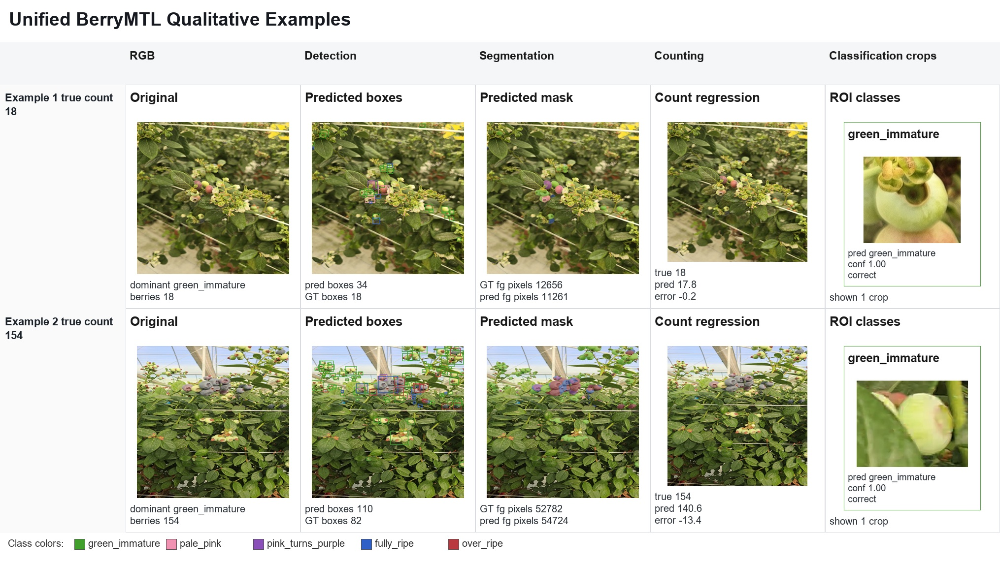
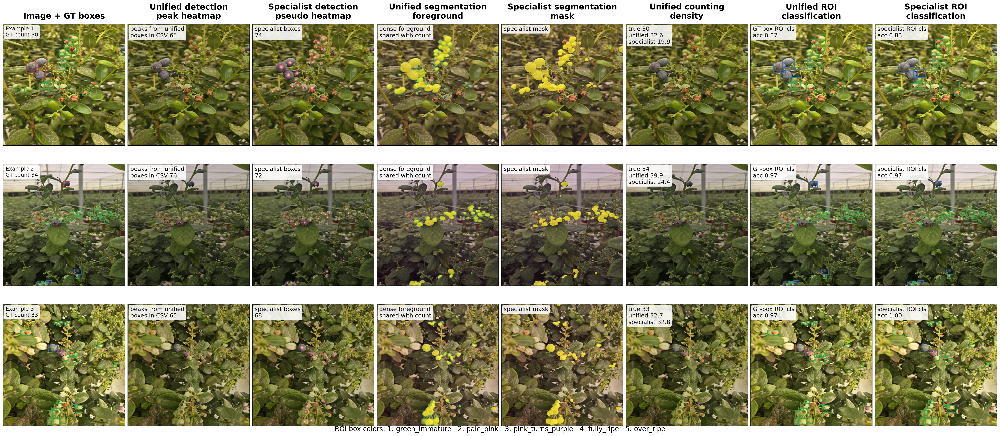

# Blueberry Benchmark

This repository contains the benchmark code, result tables, figures for the blueberry multi-task benchmark.

Contact details for data access: iyyakutti.ganapathi@ku.ac.ae.

## Contents

```text
configs/                 Benchmark configuration
figures/                 Benchmark figures
results/                 Key benchmark CSV tables
scripts/                 Benchmark, visualization, and bundle-building scripts
src/blueberry_multitask/ Source package used by benchmark scripts
requirements.txt         Python dependencies
```

## Main Benchmark Claim

The benchmark evaluates four tasks:

- detection
- segmentation
- counting
- multiclass ripeness classification

It compares specialist baselines with unified BerryMTL variants that produce all four outputs from one shared model.

## BerryMTL


## Performance Comparison


## Reproducibility

After placing the dataset locally, edit `configs/fresh_benchmark_514.yaml` and run:

```bash
python scripts/fresh_prepare_annotations.py --config configs/fresh_benchmark_514.yaml --rebuild
python scripts/fresh_run_all.py --config configs/fresh_benchmark_514.yaml
python scripts/fresh_summarize.py --config configs/fresh_benchmark_514.yaml
python scripts/build_latex_bundle_514.py --config configs/fresh_benchmark_514.yaml
```


